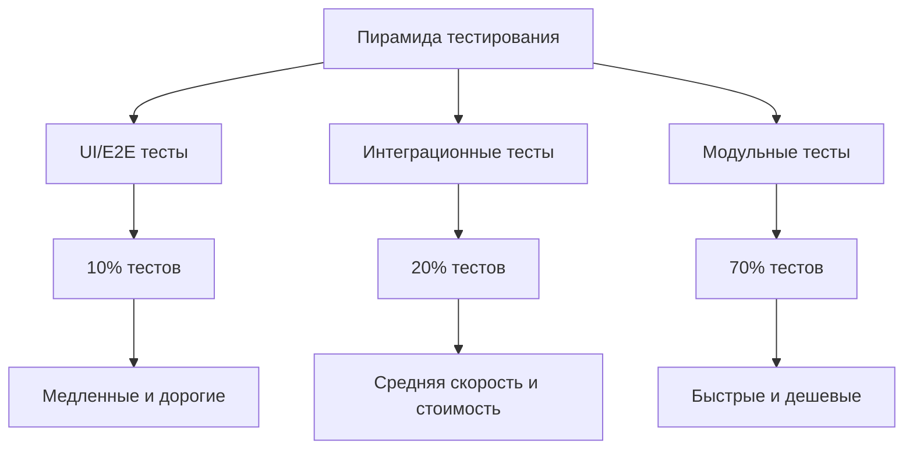
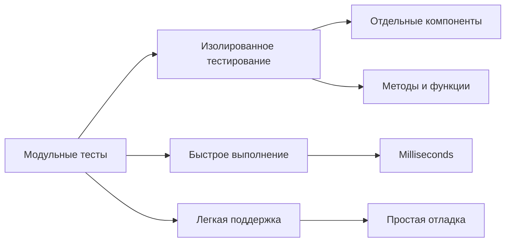
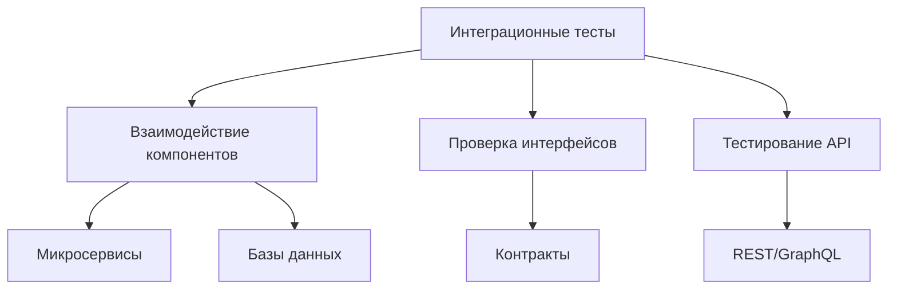
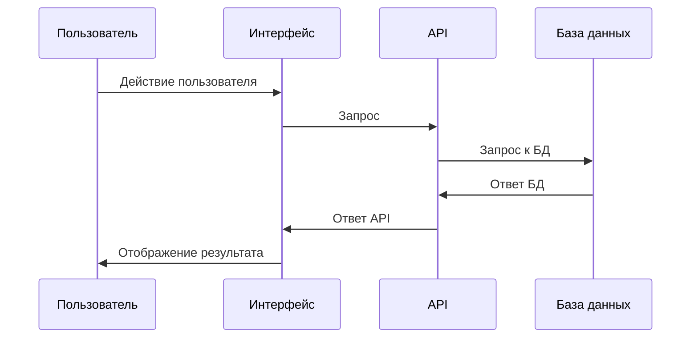
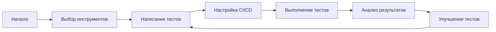
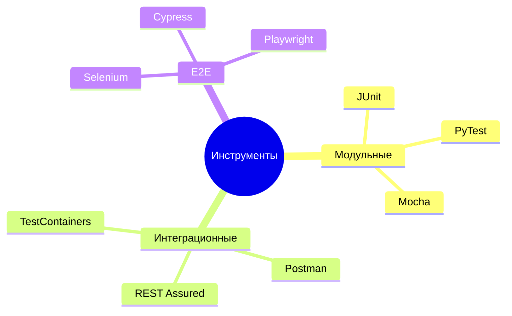
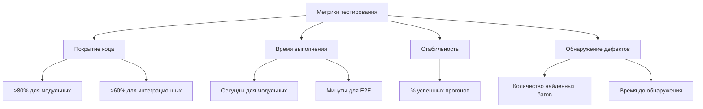
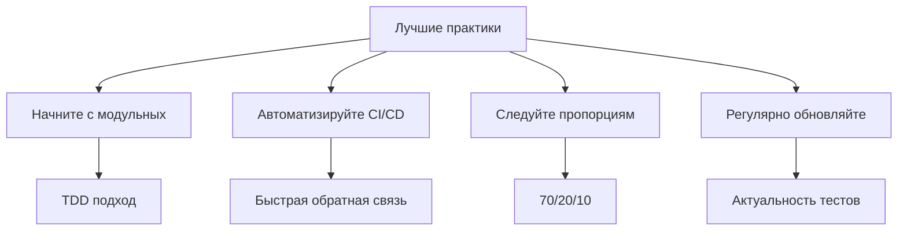
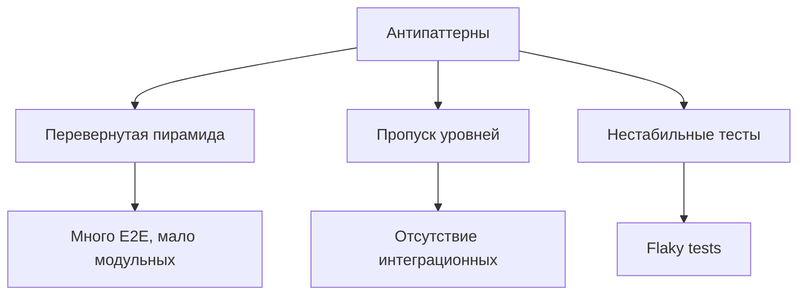

# Пирамида тестирования

## Содержание
1. [Введение в пирамиду тестирования](#введение-в-пирамиду-тестирования)
2. [Уровни пирамиды тестирования](#уровни-пирамиды-тестирования)
3. [Автоматизация тестирования](#автоматизация-тестирования)
4. [Метрики и показатели](#метрики-и-показатели)
5. [Лучшие практики](#лучшие-практики)

## Введение в пирамиду тестирования

Пирамида тестирования - это концепция, которая помогает командам разработки создавать более качественное программное обеспечение путем определения различных уровней тестирования и их пропорций.

### Структура пирамиды тестирования

## Уровни пирамиды тестирования

### Модульные тесты

### Интеграционные тесты

### UI/E2E тесты

## Автоматизация тестирования

### Процесс автоматизации

### Инструменты для разных уровней

## Метрики и показатели

### Ключевые метрики

## Лучшие практики

### Рекомендации по внедрению

### Антипаттерны

### Советы по поддержке

- Регулярно обновляйте тестовые сценарии
- Следите за временем выполнения
- Анализируйте причины нестабильных тестов
- Поддерживайте баланс между уровнями
- Используйте современные инструменты и подходы
